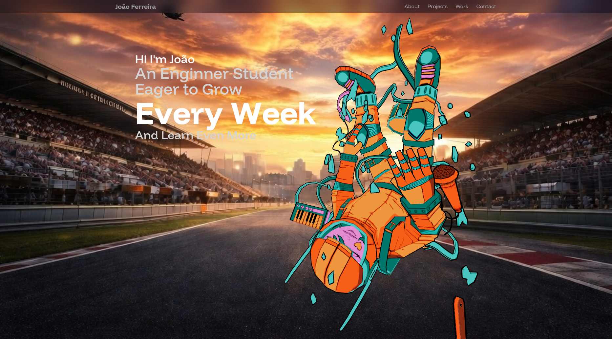

# 🇲🇨 3D Developer Portfolio

A modern, animated 3D developer portfolio built with React, Three.js, TailwindCSS, and motion effects.



---

## 📚 Table of Contents

- [Features](#-features)
- [Tech Stack](#-tech-stack)
- [Project Structure](#-project-structure)
- [Getting Started](#-getting-started)
- [Assets](#-assets)
- [Inspired By](#-inspired-by)

---

## ✨ Features

- 🔥 3D visuals powered by **React Three Fiber** and **Drei**
- ⚡ Smooth transitions and scroll-based animations using **Framer Motion**
- 🎨 Clean, responsive UI with **TailwindCSS**
- 💌 Working contact form using **EmailJS**
- 🧱 Beautiful UI enhancements with **Aceternity UI** and **Magic UI**
- 🚀 Lightning-fast development with **Vite**

---

## 🛠 Tech Stack

| Tech              | Description                           |
|------------------|---------------------------------------|
| React             | Front-end JavaScript library          |
| Vite              | Fast bundler and dev environment      |
| TailwindCSS       | Utility-first CSS framework           |
| React Three Fiber | 3D rendering with Three.js in React   |
| Drei              | Helpers and abstractions for R3F      |
| Framer Motion     | Animation library for React           |
| EmailJS           | Form handling and email integration   |
| Aceternity UI     | Custom UI components                  |
| Magic UI          | Prebuilt UI elements and design extras|

---

## 📁 Project Structure

```bash
├── public/
│   ├── assets/             # Images, textures, models
│   ├── models/             # 3D models
├── src/
│   ├── components/         # Reusable components
│   ├── constants/          # Project data, socials
│   ├── sections/           # Portfolio sections (Hero, About, Projects...)
│   ├── App.jsx             # Main app file
│   ├── main.jsx            # Entry point
│   └── index.css           # TailwindCSS
├── tailwind.config.js
└── vite.config.js
````

---

## 🚀 Getting Started

1. Clone the Repository:

```bash
git clone https://github.com/your-username/3d-portfolio.git
cd 3d-portfolio
```

2. Install Dependencies:

```bash
npm install
```

3. Run the Development Server:

```bash
npm run dev
```

App will be available at [http://localhost:5173](http://localhost:5173)

---

## 🔗 Assets

Assets used in the project (images, textures, models) can be found in the `public/assets` folder.

## Inspired By

This project was **inspired by the amazing portfolio of Ali Sanati**, both his [GitHub repository](https://github.com/Ali-Sanati/Portfolio) and the [YouTube video tutorial](https://www.youtube.com/watch?v=S9UQItTpwUQ).
All credit for the original layout, 3D ideas, and animation effects goes to him — this project is my **personal adaptation and implementation**.

---

